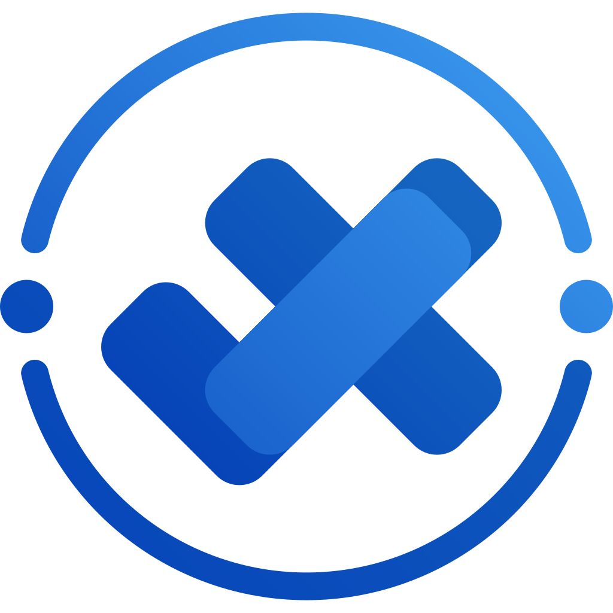
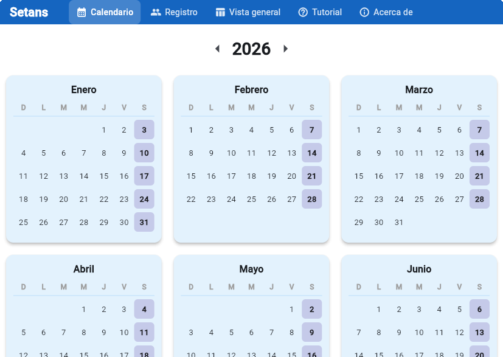

<div align="center">
    <h1>Setans</h1>
    <p>
        
    </p>
    <p>A desktop app for tracking student attendance.</p>
    <p>
        
        
        
    </p>
</div>

---



## 📋 What it does

- **Calendar** — browse months and pick a day to manage
- **Attendance** — mark students present or absent per day
- **Students** — register, search, edit, and delete
- **Overview** — full table of all students × all dates, export to CSV
- **Profile** — per-student history with quick mark buttons
- **Tutorial** — interactive walkthrough on first run

## 🛠 Build

```bash
flutter pub get
dart run build_runner build
flutter build linux
```
